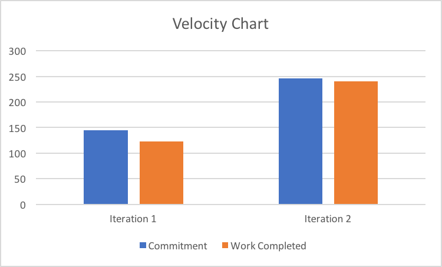

## Retrospective

After 2 iterations, we had basically achieved our goal - allowing customers to browse and purchase books. However, there were still some aspects which did not yet  meet our expectations. 

The functionality of the Library, which allows the customer to view their purchased books does nothing more than display a collection of books. It should have delivered the customer a more convenient way to access their purchased books. In order to achieve this convenience, each book that is displayed in Library activity will be linked to its corresponding book description page, so that the customers wont need to spend excessive time and effort looking for their books, and information about those books, in a our complete book inventory.

In addition, the book ordering function has some flaws regarding the delivery address. Customers are allowed to purchase books without specifying their address. What's more, if you click the CANCEL button during the address modification, the app will lead you to the Homepage instead of where you were few seconds ago. These flaws will be fixed by introducing several more conditional check, so that books cannot be purchased if they don't have a destination to be delivered. Also, when the customer clicks the CANCEL button in the address editing page, they will be lead to the previous page where they were a few seconds ago.

Besides the realization of the features, once HSQLDB had been introduced our team gave up on full stack development, with each member settling into their own niche topic in an attempt to accelerate the work flow. Essentially only one member of the team focused on handling the database issues, it's horrible to have a thought of what would happen if that person had a car crash, in every sense. To correct this unstable situation, every member have slowly begun learning to work on the HSQLDB as a full-stack developer.

This iteration will be considered successful if the following scenarios are achieved: 
1. The Library activity helps customer save a large amount of time searching for books they purchased before and useful information can be accessed by clicking on each book (50% or greater reduction in time spent searching for previously purchased books).
2. The purchase action will not be allowed if no valid address is provided, and the correct page will be displayed when navigating between different activities.
3. More than one team members are be able to use HSQLDB and apply the knowledge in feature realization and testing.
4. As a whole, if this project can help the customers reduce their time spent finding books of interest by a significant amount (greater than 20%), and the average percentage of purchases made by each customer from the recommended books list comprises at least 25% of their total purchases.

---

## Velocity Chart
